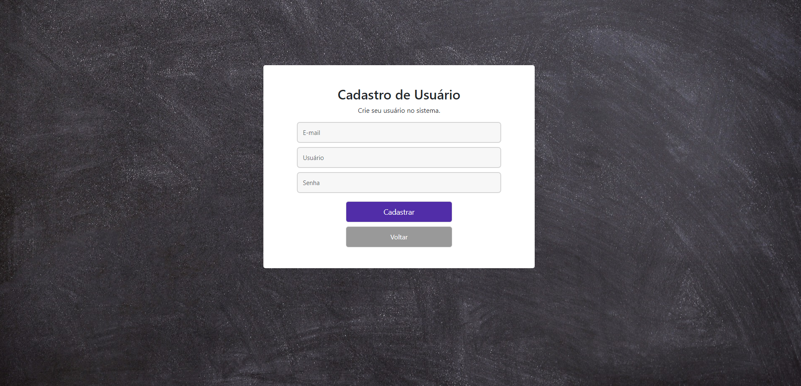
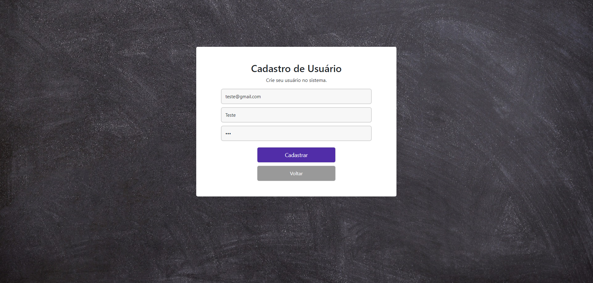
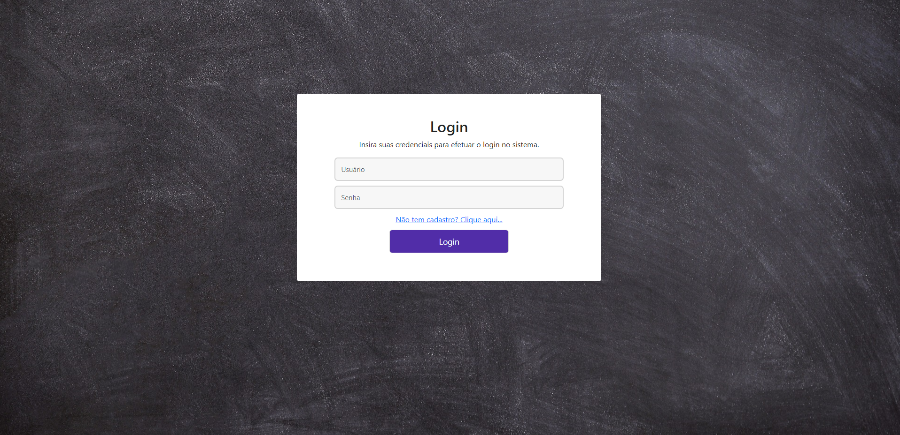
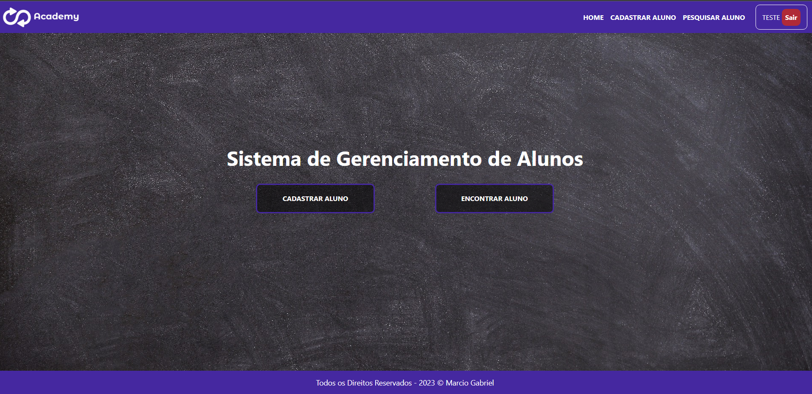
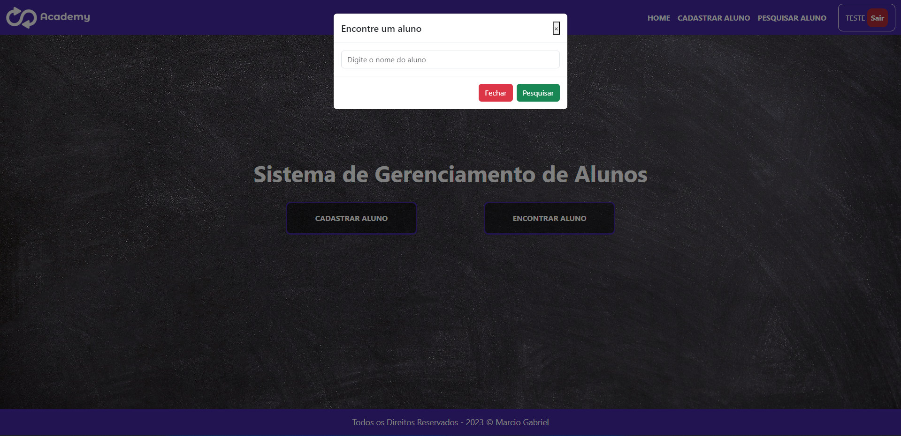
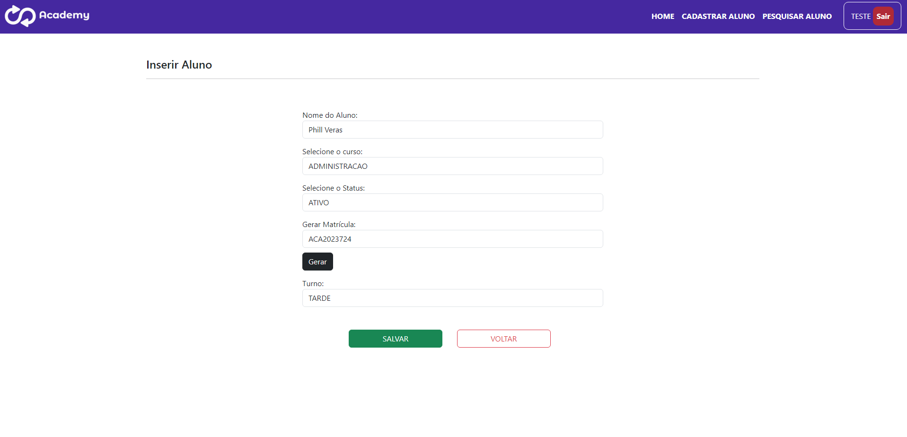

# Academy

## O Academy é um sistema de gerencimento de alunos, utilizando...
- Spring Boot
- Spring Data JPA
- Thymeleaf
- Lombok
- Devtools
- MySQL
- HTML
- CSS
- JavaScript
- Bootstrap
- JQuery

 

# Imagens

## Página de Cadastro

 

 

 

## Página de Login

 

 

 

## Página Home

 

 

 

## Página de Cadastro de Alunos

 

 

 

## Página de Alunos Cadastrados

 

 
